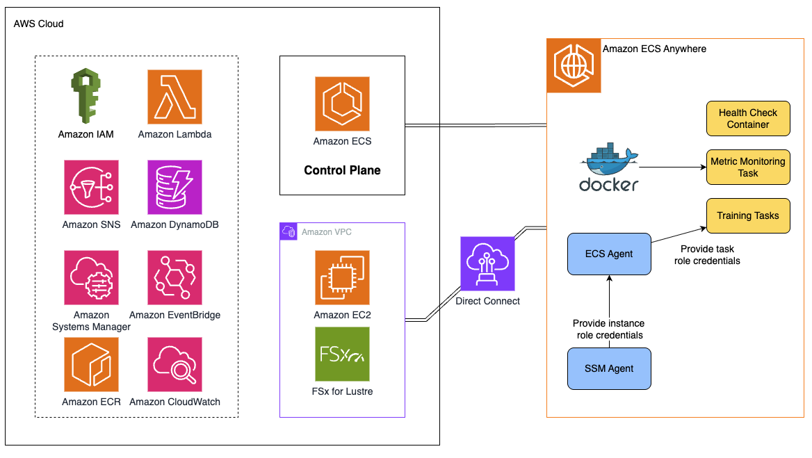
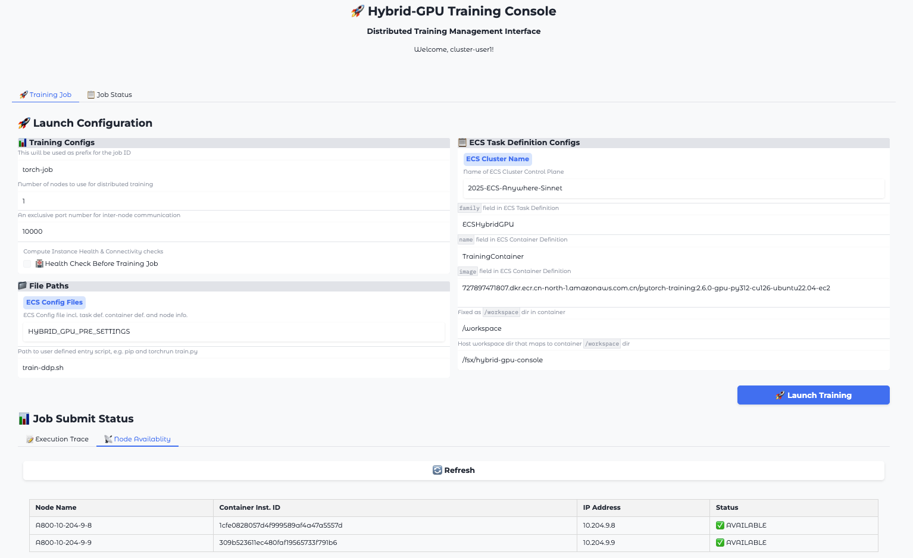

# Sample Hybrid GPU High Resilience Solution

This sample solution provides a way to manage GPU clusters with deep integration into AWS cloud services, relying on Amazon ECS, Amazon FSx, SNS, Systems Manager, and other services. It also enables rapid deployment of any GPU cluster management based on Amazon ECS Anywhere and Direct Connect (Optional). The overall architecture is shown in:

Also, a graphic UI is integrated in this solution, with completely customizable training scripts, to help facilitate different training workloads you need to run.

## Design
1. When the environment is ready, launch health check tasks
  - The purpose of health check tasks is to detect potential failures as quickly/early as possible and promptly notify relevant personnel to fix issues.
  - This is optional and can be chosen to run as a prerequisite health check before submitting actual training tasks.
2. Continuously run a host/instance level metric collection task in the background
  - The purpose of this task is to regularly push more host/instance level metrics (such as CPU utilization, system memory usage, disk utilization, GPU utilization, network traffic, etc.) to CloudWatch and dashboards, providing administrators or technical staff with more information.
3. Submit training tasks through the UI interface
  - Select all GPU nodes required for the training task from the UI interface, then submit the training task. Before the actual training task executes, the health check task will be run and must pass before the training task is officially submitted.
4. Review training logs, metric monitoring, and timely alerts
  - When training tasks fail, many situations require manual review of training logs to locate and quickly resolve issues.
5. Automatic recovery of training tasks when GPU-related components experience temporary failures
  - When a training task fails, we check whether it might be related to GPU components. If so, we automatically restart the instance containing the GPU, then automatically re-execute the entire training task, giving the training task another opportunity to execute.

## Key Features

- Automatic detection of GPU task failures
- NVIDIA DCGM health checks for GPU diagnostics
- Self-healing through instance reboots
- Automatic task restart after recovery
- Notification system for unrecoverable failures
- Retry limiting to prevent infinite recovery loops

## Setup and Deployment

Please refer to the [Deployment and Usage Manual](https://amzn-chn.feishu.cn/docx/JH5AdZSlFoOAzgxvWU6c0KQXnwb?from=from_copylink) for detailed configuration and deployment procedures. Or you may contact any of the following contributors.

## Contacts
liangaws@amazon.com 
ericacn@amazon.com 
bingjiao@amazon.com 
haozhn@amazon.com

## Security

See [CONTRIBUTING](CONTRIBUTING.md#security-issue-notifications) for more information.

## License

This library is licensed under the MIT-0 License. See the LICENSE file.
